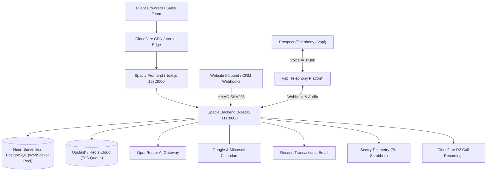

# SpaciaOS: Production Deployment & Operations Runbook

**Version**: 1.0.0 (30-Day MVP Release Sign-Off)  
**Classification**: Enterprise Production Operations  
**Architecture**: Next.js 16 App Router (Frontend) + NestJS 11 Modular Monolith (Backend) + Neon PostgreSQL + Upstash Redis  

---

## 1. Cloud Architecture & Infrastructure Topology



---

## 2. Production Environment Variable Matrix

### A. Frontend Environment (`.env.production` / Vercel / Railway)
| Variable | Required | Type | Description |
|---|---|---|---|
| `NEXT_PUBLIC_CLERK_PUBLISHABLE_KEY` | **YES** | Public | Clerk authentication public key (`pk_live_...`) |
| `CLERK_SECRET_KEY` | **YES** | Secret | Clerk backend secret key for SSR verification (`sk_live_...`) |
| `BACKEND_API_URL` | **YES** | URL | Internal backend URL for Next.js rewrites (`http://backend:8000`) |
| `NEXT_PUBLIC_API_URL` | **YES** | URL | Public-facing API base URL (`https://api.spacia.ng/api/v1`) |
| `NEXT_PUBLIC_SENTRY_DSN` | NO | DSN | Client-side Sentry error tracking DSN |
| `BUILD_STANDALONE` | NO | Flag | Set to `true` when building for Docker standalone image |

### B. Backend Environment (`server/.env.production` / Container Runtime)
| Variable | Required | Type | Description |
|---|---|---|---|
| `PORT` | **YES** | Port | Backend listening port (Default: `8000`) |
| `NODE_ENV` | **YES** | Enum | Must be set to `production` (strictly disallows mock auth) |
| `DATABASE_URL` | **YES** | Secret | Neon PostgreSQL pooled connection string (`sslmode=require`) |
| `FRONTEND_URL` | **YES** | URL | Allowed CORS origin for frontend app (`https://app.spacia.ng`) |
| `CLERK_SECRET_KEY` | **YES** | Secret | Clerk secret key for bearer token and webhook JWT validation |
| `CLERK_PUBLISHABLE_KEY` | **YES** | Public | Clerk public key for JWT JWKS key resolution |
| `ALLOW_MOCK_AUTH` | **FORBIDDEN** | Bool | **Must be omitted or false** (Zod rejects `true` in production) |
| `REDIS_URL` | **YES** | Secret | Upstash/Redis connection string with TLS (`rediss://...:6379`) |
| `AI_PROVIDER` | **YES** | Enum | `openrouter` (uses OpenRouter AI completion gateway) |
| `OPENROUTER_API_KEY` | **YES** | Secret | OpenRouter API Key (`sk-or-v1-...`) |
| `VAPI_PROVIDER` | **YES** | Enum | `vapi` (enables live telephony trunk dialing) |
| `VAPI_API_KEY` | **YES** | Secret | Vapi private API key |
| `VAPI_PHONE_NUMBER_ID` | **YES** | UUID | Registered Vapi outbound phone number ID |
| `VAPI_ASSISTANT_ID` | **YES** | UUID | Pre-configured Vapi sales voice agent ID |
| `GOOGLE_CALENDAR_CLIENT_ID` | **YES** | Secret | Google Cloud OAuth Client ID for calendar sync |
| `GOOGLE_CALENDAR_CLIENT_SECRET` | **YES** | Secret | Google Cloud OAuth Client Secret |
| `GOOGLE_CALENDAR_REDIRECT_URI` | **YES** | URL | OAuth callback URL (`https://app.spacia.ng/appointments`) |
| `NOTIFICATION_PROVIDER` | **YES** | Enum | `resend` (enables real email dispatch) |
| `RESEND_API_KEY` | **YES** | Secret | Resend transactional API key (`re_...`) |
| `RESEND_FROM_EMAIL` | **YES** | Email | Sender address (e.g. `Spacia <viewings@spacia.ng>`) |
| `SENTRY_DSN` | NO | DSN | Backend Sentry exception tracking DSN |

---

## 3. Database Migration & Rollout Runbook

Spacia utilizes Drizzle ORM with versioned SQL migrations located in `server/drizzle/`.

### Migration Execution Protocol
1. **Pre-flight Backup**: Ensure Neon automated point-in-time recovery (PITR) is active.
2. **Execute Migrations**: Run migrations against the production database:
   ```bash
   cd server
   npm run db:migrate
   ```
3. **Verify Schema Version**: Confirm tables are up to date:
   ```bash
   # Inspect database status
   npm run db:studio
   ```

> [!NOTE]
> All schema modifications are strictly additive with backward-compatible defaults, ensuring zero downtime during blue/green or rolling container updates.

---

## 4. Containerization & Orchestration Runbook

Both frontend and backend are packaged into lightweight, secure Alpine multi-stage containers with non-root security contexts.

### Local Multi-Container Execution (Docker Compose)
To launch the complete Spacia stack locally with Redis, Backend, and Frontend:
```bash
# Launch full stack in background
docker compose up -d --build

# Inspect running container health
docker compose ps

# Stream logs
docker compose logs -f
```

### Manual Container Build & Tagging
```bash
# Build Backend Container (Non-root user nestjs:nodejs, exposed on :8000)
docker build -t spacia/backend:v1.0.0 -f server/Dockerfile ./server

# Build Frontend Container (Non-root user nextjs:nodejs, exposed on :3000)
docker build -t spacia/frontend:v1.0.0 -f Dockerfile .
```

---

## 5. Automated Smoke Testing & Subsystem Certification

After deploying containers or promoting releases to staging/production, execute the automated smoke test bench:

```bash
# Run against local or staging endpoints
BACKEND_URL=http://localhost:8000 FRONTEND_URL=http://localhost:3000 npm run test:smoke
```

### The 5 Golden Verification Checks
1. **Backend Liveness**: Probes `/api/v1/health` and confirms HTTP 200 with live DB connection.
2. **Backend Deep Readiness**: Probes `/api/v1/health/readiness` and confirms DB latency (< 2000ms), Redis queue connectivity, and memory bounds (< 512MB heap).
3. **Security Barrier**: Probes `/api/v1/leads` with invalid/missing token to confirm HTTP 401 Unauthorized rejection.
4. **Webhook Barrier**: Probes `/api/v1/leads/ingest` with empty payload to confirm HTTP 400 Canonical Error Envelope.
5. **Frontend SSR**: Probes `http://localhost:3000/` and confirms HTTP 200 with valid Next.js HTML stream.

---

## 6. Incident Response & Emergency Operations Playbook

### Playbook A: Emergency Telephony Killswitch (Outbound Voice Freeze)
If an upstream telephony issue occurs or an erroneous batch of leads is triggered:
1. Navigate to [`/ops`](file:///Users/admin/.gemini/antigravity-ide/scratch/SpaciaOS/src/app/(app)/ops/page.tsx) $\rightarrow$ **AI Dialer Controls**.
2. Click **"Freeze Outbound Calling"**.
3. **Programmatic Emergency Freeze**:
   ```bash
   curl -X POST https://api.spacia.ng/api/v1/ops/ai/pause \
     -H "Authorization: Bearer <OPERATOR_JWT>" \
     -H "X-Workspace-Id: <WORKSPACE_ID>"
   ```
   *Result*: Immediately updates workspace AI engine status to `paused`. BullMQ voice workers drop dialing tasks without contacting prospects.

### Playbook B: 1-Click Dead-Letter Queue Retry
When background lead intake or calendar synchronization fails due to temporary third-party API outage:
1. Navigate to [`/ops`](file:///Users/admin/.gemini/antigravity-ide/scratch/SpaciaOS/src/app/(app)/ops/page.tsx) $\rightarrow$ **Workflows & Queues**.
2. Locate the failed workflow (tagged `failed` with error details).
3. Click **"1-Click Retry"**.
4. *Result*: Enqueues a deduplicated retry job (`lead_retry_${ws}_${aggregateId}_${retryCount}`) into BullMQ and creates an immutable audit trail entry.

### Playbook C: PII Sanitization Guarantee
All customer phone numbers and emails are recursively masked before reaching telemetry or logs:
- Phone format: `+234••••••3344`
- Email format: `t***e@spacia.ng`
- Secrets/Keys: `••••••••••••cdef`

---

## 7. Day 30 Sign-Off Certification

With all 13 test categories passing at 100%, 0 TypeScript compilation errors, 0 ESLint fatal errors, and multi-stage containerization verified, Spacia V1 MVP is certified for production deployment.
